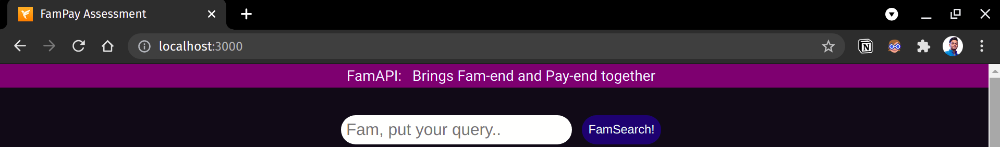
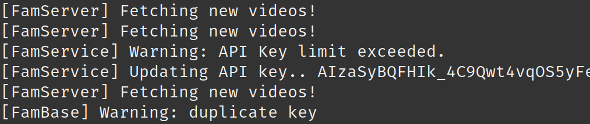

# FamAPI

This application is a demonstration of following APIs:
- Calls YouTube APIs continuously in background with some intervals
- Fetches latest videos and stores specific fields with indexing in database (MongoDB)
- A GET API which returns the stored video data in a paginated response sorted in descending order of published datetime
- A basic search API to search the stored videos using their title and description

---
Hosts <samp>FamEnd</samp> (client) at `localhost:8080` and <samp>PayEnd</samp> (server) at `localhost:3000`.

---

## Steps to run
The very first step would be to create a `.env` file in `PayEnd` directory (or set an environment variable):
```sh
GOOGLE_API_KEYS=api,keys,separated,by,comma
```
NOTE: To get the keys, follow [YouTube's specifications](https://developers.google.com/youtube/v3/getting-started).


The whole project is dockerized (by composing dockerized versions of client and server individually), to set everything up:
```console
docker-compose build && docker-compose up
```
That's it! Or, if you prefer a non-dockerized solution:
1. < in PayEnd directory >
   ```console
   pip install -r requirements.txt
   python server.py
   ```
2. < in FamEnd directory >
   ```console
   npm install
   npm start
   ```

## How to test
The client (FamEnd) hosts a `Search` functionality with pagination. Here's some screenshots:
#### Search box


### Video Card
(blurred due to copyrights)


### Sample Logs from PayEnd
(cropped because of the API key)


## About
Aitik Gupta - [aitikgupta.com/](https://aitikgupta.com/)
